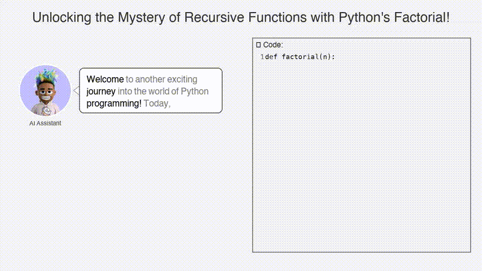
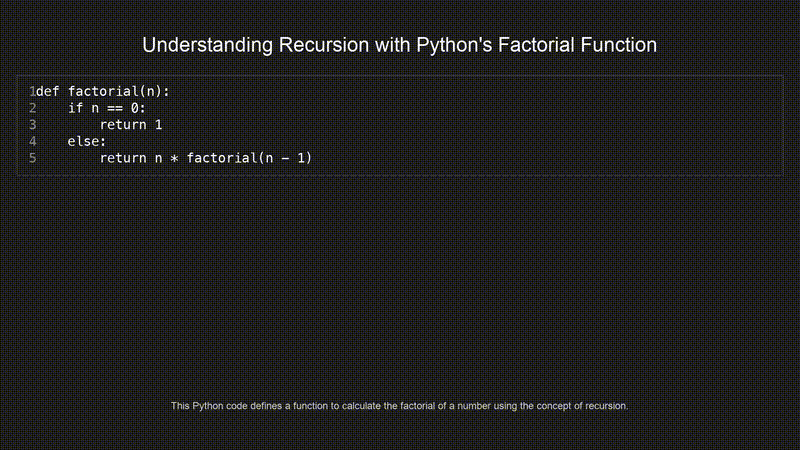

# Code2Vid

**AI-Powered Code Explanation Video Generator**

Code2Vid transforms code snippets into professional, narrated educational videos using advanced AI technology. The platform leverages GPT-4 for intelligent code analysis, high-quality text-to-speech engines for natural narration, and sophisticated video rendering for synchronized code highlighting.

## Key Features

- **AI-Powered Explanations**: GPT-4 generates clear, context-aware code explanations
- **High-Quality TTS**: Multiple text-to-speech engines (ElevenLabs, pyttsx3) for natural narration
- **Professional Video Output**: Syntax-highlighted code with perfectly synchronized narration
- **Multiple Video Styles**: Simple static display, animated highlighting, typewriter effects, and avatar mode
- **Web Interface**: Intuitive Streamlit application for seamless user experience
- **Multi-Language Support**: Comprehensive support for Python, JavaScript, Java, C++, and more
- **Audience Targeting**: Tailored explanations for beginner, intermediate, or advanced developers

## Video Demonstrations

### Avatar Mode with Speech Bubbles
The avatar mode features an AI assistant that presents explanations with speech bubbles and synchronized text highlighting:



### Typewriter Mode with Synchronized Text
The typewriter mode reveals text character-by-character, perfectly synchronized with the narration:


### Simple Clean Layout
For a minimalist approach, the simple mode focuses on clean code presentation:



## Quick Start

### 1. Installation

```bash
# Clone the repository
git clone <repository-url>
cd Code2Vid

# Install dependencies
pip install -r requirements.txt
```

### 2. Set up API Keys

You'll need API keys for the AI services:

```bash
# Set environment variables
export OPENAI_API_KEY="your-openai-api-key"
export ELEVENLABS_API_KEY="your-elevenlabs-api-key"  # Optional, for better TTS
```

### 3. Run the Web Interface

```bash
streamlit run app.py
```

Open your browser to `http://localhost:8501` and start creating videos!

## Usage

### Web Interface (Recommended)

1. **Open the app**: Run `streamlit run app.py`
2. **Enter your API keys** in the sidebar
3. **Paste your code** in the text area
4. **Configure settings** (language, difficulty, voice, etc.)
5. **Click "Generate Video"** and wait for processing

### Command Line

```python
from code2vid import Code2Vid

# Initialize
code2vid = Code2Vid()

# Create a video
result = code2vid.create_video(
    code="""
def fibonacci(n):
    if n <= 1:
        return n
    return fibonacci(n-1) + fibonacci(n-2)
    """,
    language="Python",
    difficulty_level="beginner",
    voice="default",
    video_style="simple"
)

print(f"Video created: {result['video']}")
```

### Individual Modules

You can also use the modules independently:

```python
# Generate explanation only
from explain_code import CodeExplainer
explainer = CodeExplainer()
explanation = explainer.explain_code("your code here")

# Convert text to speech
from text_to_speech import TextToSpeech
tts = TextToSpeech(engine="elevenlabs")
audio_path = tts.generate_speech("your text here")

# Create video
from video_renderer import VideoRenderer
renderer = VideoRenderer()
video_path = renderer.create_video(code, audio_path, explanation)
```

## Architecture

The project consists of four main modules:

### 1. `explain_code.py` - AI Code Explanation
- Uses GPT-4 to generate structured explanations
- Supports multiple programming languages
- Creates narration scripts optimized for video
- Outputs JSON with title, overview, step-by-step breakdown, and key takeaways

### 2. `text_to_speech.py` - Audio Generation
- Multiple TTS engines (ElevenLabs, pyttsx3)
- Voice selection and speed control
- Audio processing and optimization
- Duration estimation

### 3. `video_renderer.py` - Video Creation
- Syntax highlighting for code
- Multiple video styles (simple, animated)
- Professional styling with dark theme
- Synchronized audio-video rendering

### 4. `app.py` - Web Interface
- Intuitive Streamlit interface
- Real-time preview and statistics
- Example code snippets
- Download functionality

## Video Styles

### Simple Style
- Static code display with syntax highlighting
- Clean, professional appearance
- Suitable for most use cases

### Animated Style
- Code sections highlight as they're explained
- Dynamic transitions between code parts
- More engaging for complex explanations

## TTS Engines

### ElevenLabs (Recommended)
- **Pros**: High-quality, natural-sounding voices
- **Cons**: Requires API key, usage limits
- **Best for**: Professional content, public videos

### pyttsx3 (Free)
- **Pros**: Free, no API key required, offline
- **Cons**: Lower quality, robotic sound
- **Best for**: Testing, personal use

## Output Files

Each video generation creates:

- **`*_explanation.json`**: Structured explanation data
- **`*_narration.wav`**: Audio narration file
- **`*_simple.mp4`** or **`*_animated.mp4`**: Final video file

## Configuration

### Environment Variables

```bash
OPENAI_API_KEY=your-openai-api-key          # Required
ELEVENLABS_API_KEY=your-elevenlabs-api-key  # Optional
```

### Video Settings

- **Resolution**: 1920x1080 (configurable)
- **FPS**: 30 (configurable)
- **Background**: Dark theme (#1E1E1E)
- **Code Area**: Slightly lighter (#2D2D30)

## Examples

The web interface includes several example code snippets:

- **Fibonacci Function**: Recursive implementation
- **Bubble Sort**: Simple sorting algorithm
- **Class Example**: Object-oriented programming
- **Quick Sort**: Divide-and-conquer algorithm
- **Binary Search**: Efficient search algorithm

## Development

### Project Structure

```
Code2Vid/
├── explain_code.py      # AI code explanation
├── text_to_speech.py    # TTS functionality
├── video_renderer.py    # Video creation
├── code2vid.py         # Main orchestrator
├── app.py              # Streamlit web interface
├── requirements.txt    # Dependencies
└── README.md          # This file
```

### Adding New Features

1. **New TTS Engine**: Extend `TextToSpeech` class
2. **New Language**: Add syntax highlighting in `CodeHighlighter`
3. **New Video Style**: Create new method in `VideoRenderer`
4. **New UI Feature**: Modify `app.py`

## Contributing

1. Fork the repository
2. Create a feature branch
3. Make your changes
4. Add tests if applicable
5. Submit a pull request

## License

This project is licensed under the MIT License - see the LICENSE file for details.

## Acknowledgments

- **OpenAI**: For GPT-4 API
- **ElevenLabs**: For high-quality TTS
- **Streamlit**: For the web framework
- **MoviePy**: For video processing
- **pyttsx3**: For free TTS option

## Troubleshooting

### Common Issues

**"OpenAI API key required"**
- Set your OpenAI API key as an environment variable
- Or pass it directly to the Code2Vid constructor

**"ElevenLabs not available"**
- Install with: `pip install elevenlabs`
- Or use pyttsx3 as fallback

**"moviepy not available"**
- Install with: `pip install moviepy`
- On macOS, you might need: `brew install ffmpeg`

**Video rendering fails**
- Ensure ffmpeg is installed
- Check available disk space
- Try reducing video resolution

### Performance Tips

- Use ElevenLabs for better quality (requires API key)
- Keep code snippets under 100 lines for faster processing
- Use "simple" video style for quicker rendering
- Close other applications during video generation

## Support

If you encounter any issues:

1. Check the troubleshooting section above
2. Search existing GitHub issues
3. Create a new issue with detailed information
4. Include error messages and system information

---

**Transform your code into engaging educational content with Code2Vid.** 
